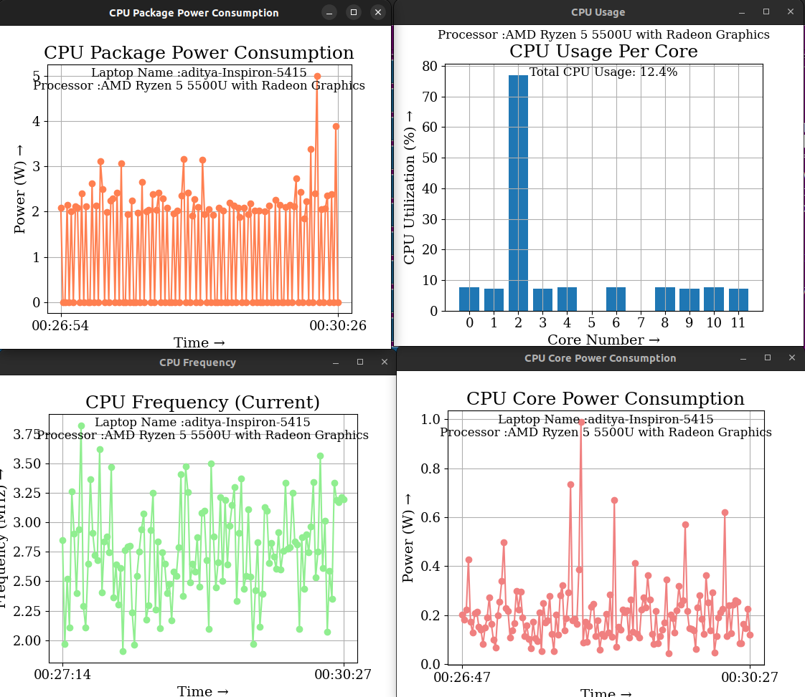
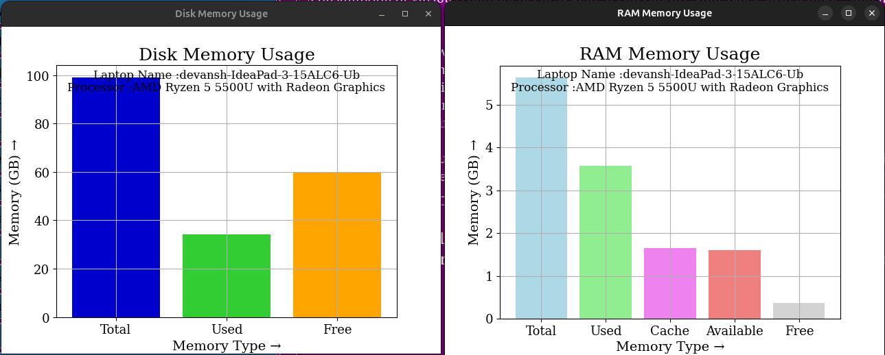
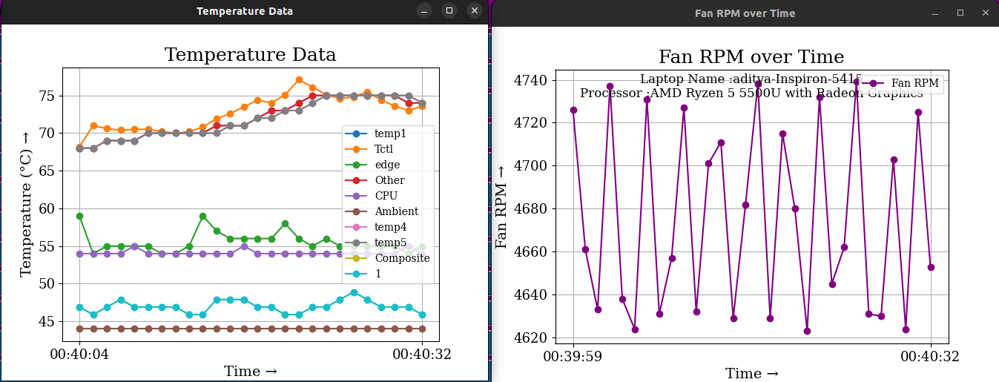
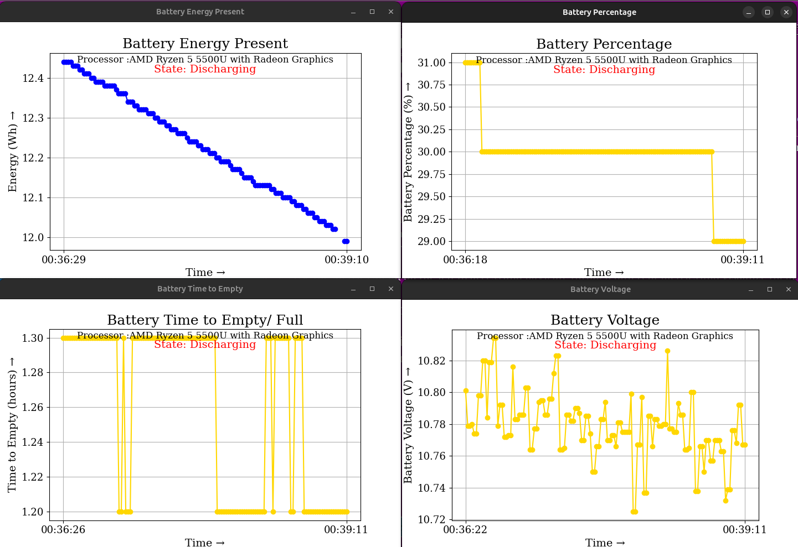
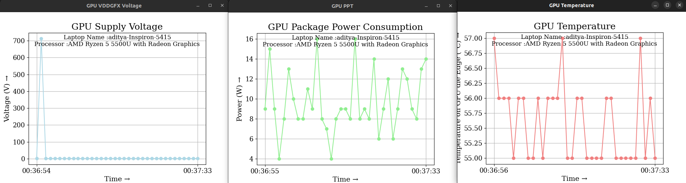

# Mantle©: A comprehensive Power Management tool designed to monitor and display various system metrics and manage telemetry data in real-time ⚡🔋
## PS01: Power Manager Telemetry

In the era of 5G and edge computing, the deployment of devices across different locations,has increased, leading to higher power consumption. To adress this issue corporations and governments worldwide have initiated steps to achieve net-zero power consumption. Additionally, the price of electricity is increasing, making it crucial to understand the total power drawn by the system.  

The main objectives of this project include the following -  
    1. Researching and identifying open-source tools for power measurement.  
    2. Identifying and documenting the available knobs in a system to measure power.  
    3. Collect power telemetry data from CPU, memory, NIC, and TDP etc.  
    4. Measure and record system power utilization for CPU, NIC, and TDP based on the input parameter of system utilization percentage.  

## Demonstration of the Project

[file:///home/NewUser/Downloads/myvideo.mp4](https://github.com/user-attachments/assets/a8be6476-c581-4504-938b-dc3137a348ed)

## Features of Mantle
  
### 1. CPU Metrics:
Mantle© provides real-time monitoring of CPU utilization. It displays the percentage of CPU usage for each individual core, allowing users to see which cores are under heavy load and which are idle. This helps in understanding the distribution of processing tasks across the CPU. C-states (idle states) are various levels of CPU idle modes where parts of the CPU can be powered down to save energy. Our GUI visualizes these states, showing the percentage of time the CPU spends in each C-state.  

**Power Consumption:** The tool also measures the power consumption of both individual cores and the entire CPU package (CPU Cores,Cache Memory,Memory Controller,IGP,IHS, etc). This includes tracking how much power each core is using and the overall power usage of the CPU package, giving insights into energy efficiency and potential areas for optimization.   
  

 CPU Metric Plots

                                   
  
### 2. RAM and Disk Memory Usage:
Mantle© monitors the system's RAM usage, displaying the amount of memory currently in use versus available memory. This helps in identifying memory-hungry applications and potential memory bottlenecks.  
  
**Disk Usage:** The tool tracks disk usage statistics, showing the amount of disk space used and available. It provides insights into disk performance and storage capacity, helping users manage their data storage more effectively.  

 

 Memory Usage Plots

  
  
### 3. Temperature Monitoring and Power Mode Switching:
Mantle© tracks the temperature of various system components, including the CPU, GPU, and other critical hardware. It displays real-time temperature readings to help users ensure their system is operating within safe thermal limits.  
  
**Power Mode Switching:** The tool allows users to switch between different power modes, such as performance mode, balanced mode, and power-saving mode. This enables users to optimize their system's power consumption based on their current needs, whether they require maximum performance or extended battery life.  

 

Temperature Plots

  
  
### 4. Battery Statistics and NIC Power Consumption:
Mantle© provides detailed battery statistics, including battery percentage, time remaining, and power state (whether the system is plugged in or running on battery). This information helps users manage their battery usage and plan for recharging.
  
**NIC Power Consumption:** The tool monitors the power consumption of the Network Interface Card (NIC), which is crucial for understanding the energy impact of network activities. It helps in optimizing network usage to reduce power consumption.

Battery Usage Plots

 
  
### 5. GPU Metrics Tracking:
Mantle© tracks various GPU metrics, including power consumption, supply voltage and temperature. This provides insights into the performance and power efficiency of the GPU, helping users optimize graphics-intensive tasks and manage thermal performance.  

 GPU Metric Plots

  

  
These features collectively provide a comprehensive view of system performance and power consumption, enabling users to monitor, manage, and optimize their system's efficiency and longevity effectively.

